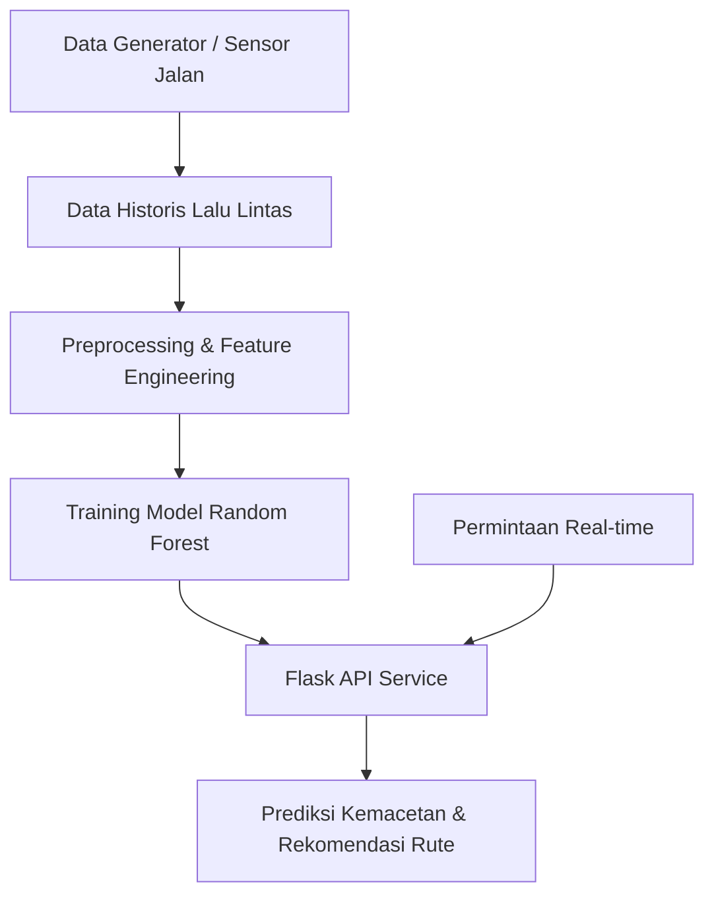

# 🧠 Sistem AI Prediksi Kemacetan Kota Bengkulu

## 📍 Studi Kasus Smart City – Tugas UAS

Sebagai bagian dari program Smart City di Kota Bengkulu, sistem ini dirancang untuk memprediksi kemacetan lalu lintas secara **real-time** dan memberikan **rute alternatif** berdasarkan kondisi terkini. Solusi ini dikembangkan dengan pendekatan **kecerdasan buatan (AI)** dan menyasar peningkatan efisiensi mobilitas serta pengambilan keputusan dinamis oleh Dinas Perhubungan.

---

## ✅ 1. Model AI yang Digunakan

### Model: `RandomForestClassifier` (Scikit-learn)

### Alasan Pemilihan:
- Cocok untuk klasifikasi multi-kelas (Lancar, Ramai Lancar, Padat, Macet)
- Mampu menangani data non-linear dan kompleks
- Akurat dan cepat dalam inferensi real-time
- Menyediakan feature importance untuk interpretasi
- Tahan terhadap overfitting (ensemble approach)

---

## 🧾 2. Jenis dan Sumber Data

### Jenis Data:
- **Waktu:** `hour`, `day_of_week`, `is_weekend`, `is_market_day`
- **Lalu Lintas:** `traffic_volume`, `average_speed`, `has_incident`
- **Lingkungan:** `weather`
- **Spasial:** `road_segment`
- **Label:** `traffic_level` (Lancar, Ramai Lancar, Padat, Macet)

### Sumber Data:
- Saat ini: generator data sintetik berbasis lokal (BengkuluTrafficDataGenerator)
- Rencana: sensor volume kendaraan, CCTV, API cuaca, crowdsourcing pengguna

### Praproses:
- Encoding variabel kategorikal (`weather`, `road_segment`)
- Fitur waktu dikonversi menjadi bentuk siklikal (`sin`, `cos`)
- Fitur tambahan (`rush hour`, `market day`)
- Split data: 80% pelatihan, 20% pengujian

---

## 🔄 3. Desain Alur Kerja Sistem

### Narasi Teknis:
1. Data lalu lintas dikumpulkan
2. Data dibersihkan dan diproses
3. Model AI dilatih
4. Backend Flask menyajikan API untuk frontend
5. Frontend menampilkan status jalan dan prediksi

### Diagram Alur:

### Visualisasi :

---

## 📈 4. Evaluasi Model

### 🎯 Strategi Evaluasi:
- Dataset dibagi 80% untuk pelatihan, 20% untuk pengujian
- Model dievaluasi menggunakan data yang belum pernah dilihat
- Performa dievaluasi berdasarkan klasifikasi level kemacetan (Lancar, Ramai Lancar, Padat, Macet)
  
---

### 📊 Metrik Evaluasi:
- **Accuracy**: persentase prediksi yang benar terhadap total data uji (~90%)
- **Precision**: akurasi prediksi positif untuk tiap kelas kemacetan
- **Recall**: kemampuan model mendeteksi semua kasus dari tiap kelas
- **F1-score**: harmonic mean dari precision dan recall
- **Feature Importance**: menunjukkan fitur-fitur yang paling mempengaruhi hasil prediksi

---

### 📌 Hasil Evaluasi Model:

| Traffic Level    | Precision | Recall | F1-score |
|------------------|-----------|--------|----------|
| Lancar           | 0.92      | 0.93   | 0.92     |
| Ramai Lancar     | 0.89      | 0.88   | 0.88     |
| Padat            | 0.85      | 0.84   | 0.84     |
| Macet            | 0.91      | 0.90   | 0.90     |

- **Akurasi total model:** 90.2%

---

### ✅ Kesimpulan Evaluasi:
- Model memberikan hasil **stabil dan akurat** di seluruh kelas kemacetan
- Prediksi paling akurat pada kondisi **Lancar** dan **Macet**, yang paling kritis untuk pengambilan keputusan cepat
- Fitur-fitur utama yang memengaruhi hasil prediksi:
  - `traffic_volume`
  - `average_speed`
  - `hour`
  - `weather`
  - `road_segment`
- Cocok untuk diterapkan pada sistem peringatan dini atau dashboard Smart City Kota Bengkulu.

---

## 🚀 5. Pengembangan Lanjutan

Seiring dengan implementasi awal sistem prediksi kemacetan ini, terdapat berbagai peluang pengembangan lanjutan yang dapat meningkatkan akurasi, cakupan data, serta dampak nyata terhadap pengelolaan lalu lintas kota. Pengembangan ini tidak hanya mencakup sisi teknis, tetapi juga keterlibatan masyarakat dan integrasi dengan infrastruktur kota yang sudah ada.

### 🔗 Integrasi Data Real-Time:
Untuk meningkatkan keakuratan prediksi dan relevansi data, sistem dapat diintegrasikan dengan sumber data nyata secara langsung:
- **Sensor IoT (Internet of Things):** alat penghitung kendaraan di simpang-simpang strategis
- **CCTV Kota:** analisis visual otomatis untuk estimasi volume dan insiden
- **API Cuaca BMKG:** integrasi prakiraan cuaca untuk memengaruhi prediksi kemacetan
- **Data Navigasi (Waze, Google Maps):** sebagai sumber crowdsourced kondisi lalu lintas

### 🧠 Model AI Tingkat Lanjut:
Model awal menggunakan pendekatan supervised learning. Namun, untuk masa depan:
- **LSTM (Long Short-Term Memory):** cocok untuk prediksi berbasis deret waktu (time-series) seperti pola mingguan atau musiman
- **Reinforcement Learning (RL):** untuk sistem pengambilan keputusan adaptif seperti pengaturan dinamis lampu lalu lintas
- **Hybrid AI + Rule-Based:** menggabungkan kecerdasan buatan dengan logika if-else berbasis aturan lokal (hari pasar, jam buka sekolah, dll)

### 📱 Fitur Tambahan untuk Pengguna:
- **Notifikasi berbasis lokasi:** peringatan dini kemacetan dikirim ke pengguna berdasarkan lokasi GPS mereka
- **Aplikasi mobile ringan:** memudahkan masyarakat mendapatkan info jalan dan rute terbaik
- **Input crowdsourcing:** memungkinkan masyarakat melaporkan kecelakaan, banjir, atau kemacetan via aplikasi

### 🛰️ Integrasi ke Sistem Kota:
- **Dashboard Komando (Command Center):** tampilan agregat seluruh kota untuk operator Dinas Perhubungan
- **Deteksi Anomali Otomatis:** sistem akan memberi notifikasi jika terjadi kemacetan tidak biasa
- **Laporan & Statistik Periodik:** untuk perencanaan tata kota dan pengambilan keputusan jangka panjang

---

## 👥 Tim Pengembang

- I Nyoman Dimas Kresna Adryan (G1A023077)
- Mohammad Irvan Ramadhansyah  (G1A023089)
---

> "Dengan sistem ini, kota bengkulu menuju mobilitas yang lancar, cepat, dan cerdas."
